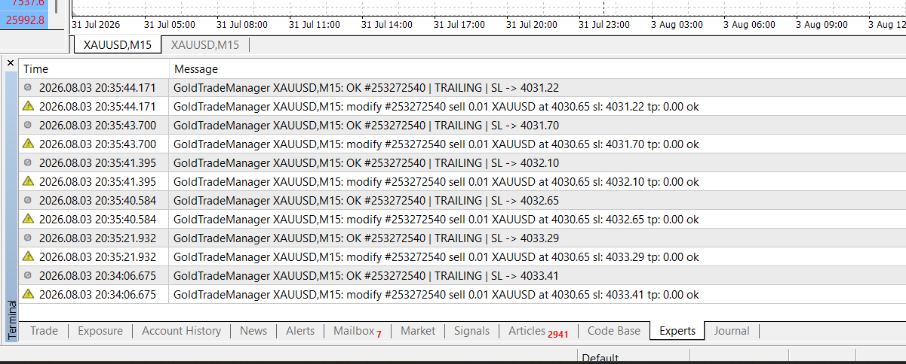
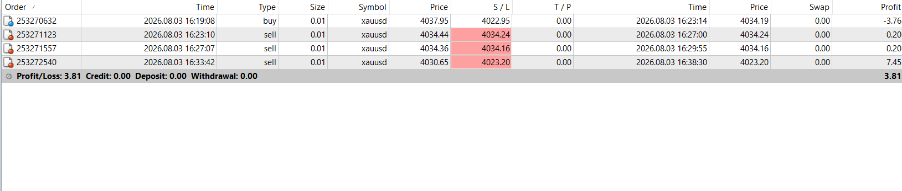

# Gold Trade Manager (MQL4)

A standalone trade manager for MetaTrader 4. It does **not** open trades — it manages positions that are already open, whether they were placed manually or by another Expert Advisor.

Built and tested on XAUUSD, but symbol-agnostic: all distances are derived from the broker's own `Digits`, `Point`, `StopLevel` and `LotStep`, so it behaves correctly on 2-digit gold and 5-digit FX alike.

---

## Why this exists

Most retail EAs and manual traders share the same gap: entries are handled, exits are not. Stops sit where they were placed at entry and never move. This tool adds the missing exit layer:

- **Breakeven** — moves stop loss to entry (plus an offset) once the position is far enough in profit
- **Trailing stop** — stop follows price at a fixed point distance or at a multiple of ATR
- **Partial close** — closes a percentage of the position at a profit threshold

Each module can be enabled independently.

---

## Installation

1. Copy `GoldTradeManager.mq4` to `<MT4 data folder>/MQL4/Experts/`
2. Open MetaEditor, press **F7** to compile (expect `0 errors, 0 warnings`)
3. Restart MT4 or refresh the Navigator panel
4. Drag the EA onto a chart of the symbol you want managed
5. Enable **Allow live trading** in the Common tab

One instance manages one symbol. For multiple symbols, attach one instance per chart.

---

## Inputs

### Order filter

| Input | Default | Description |
|---|---|---|
| `FilterMode` | All orders | Manage every order on the symbol, or only those matching a magic number |
| `MagicFilter` | 0 | Magic number to match when `FilterMode` is set to magic |

Use the magic filter whenever another EA is running on the same account. Managing another EA's orders will break that EA's own exit logic.

### Breakeven

| Input | Default | Description |
|---|---|---|
| `UseBreakeven` | true | Enable the module |
| `BE_TriggerPts` | 500 | Profit in points required before the stop is moved |
| `BE_OffsetPts` | 50 | Points above entry to lock in (covers spread and commission) |

`BE_TriggerPts` must be greater than `BE_OffsetPts`; the EA refuses to initialise otherwise.

### Trailing stop

| Input | Default | Description |
|---|---|---|
| `TrailMode` | ATR based | Off, fixed points, or ATR based |
| `Trail_StartPts` | 800 | Profit in points before trailing begins |
| `Trail_DistPts` | 600 | Trail distance, fixed-point mode only |
| `Trail_StepPts` | 100 | Minimum improvement before a new modify is sent |
| `ATR_Period` | 14 | ATR period, ATR mode only |
| `ATR_Multiple` | 2.0 | Trail distance as a multiple of ATR |
| `ATR_TF` | current | Timeframe used for the ATR reading |

ATR mode is recommended on gold. A fixed distance that is comfortable during the Asian session is far too tight during US news hours, and the reverse.

### Partial close

| Input | Default | Description |
|---|---|---|
| `UsePartialClose` | false | Enable the module |
| `PC_TriggerPts` | 600 | Profit in points before closing part of the position |
| `PC_Percent` | 50.0 | Percentage of the current lot size to close |

### General

| Input | Default | Description |
|---|---|---|
| `Slippage` | 30 | Maximum slippage for the partial close |
| `TimerSeconds` | 1 | Timer interval; 0 disables the timer and relies on ticks only |
| `VerboseLog` | true | Print every action to the Experts log |

---

## Suggested starting values for XAUUSD M15

Gold on M15 typically shows an ATR between 600 and 1300 points (2-digit broker). Defaults are scaled to that range:

- Breakeven trigger at roughly 0.5x ATR
- Trailing start at roughly 0.9x ATR
- Trail distance at 2.0x ATR

A trailing distance materially tighter than 1x ATR will close most positions at breakeven before they reach target, cutting winners while leaving losers unchanged.

Re-check these numbers on your own broker and timeframe rather than adopting them blindly.

---

## Implementation notes

**Timer alongside ticks.** Trailing driven only by `OnTick()` stalls whenever the tick feed pauses — quiet sessions, weekend gaps, connection hiccups. Price moves, the stop does not. An `OnTimer()` pass runs the same management loop on a fixed interval.

**Broker limits are read at runtime.** `StopLevel` and `FreezeLevel` are re-read on every pass. A stop that is legal on a zero-stop-level ECN account is rejected as error 130 on a broker requiring 30 points of distance. All proposed stops are clamped before being sent.

**Stops only move toward profit.** Every modify is checked against the current stop first. A trailing routine without this check will widen the stop on a losing position, effectively removing it.

**Retry on transient errors.** Requote, off-quotes and price-change errors (128, 129, 135, 136, 138) are normal market conditions, not bugs. Those attempts refresh prices and retry up to three times. Error 1 (nothing modified) exits immediately rather than looping.

**`Trail_StepPts` throttles server traffic.** Without a minimum improvement threshold, the EA would issue a modify on nearly every tick. Some brokers throttle or disconnect on that volume.

**Partial close state.** MT4 assigns a new ticket to the remainder after a partial close, so a ticket list cannot be used to track what has already been reduced. This build uses the stop loss position as the state flag: partial close is only permitted while the stop is still worse than entry, and the stop is moved to breakeven immediately afterwards, which disarms it for the remainder. The consequence is that `PC_TriggerPts` should be less than or equal to `BE_TriggerPts`, otherwise breakeven fires first and partial close never triggers.

---

## Testing

### Demo results — XAUUSD M15, Pepperstone Razor (2-digit gold)

Forward tested on a live demo feed during the London/New York overlap. Test parameters were deliberately narrowed (breakeven trigger 100 points, trailing start 100, ATR multiple 0.5) so both modules would fire within a short session. These are **not** recommended live settings.

| # | Type | Entry | Final SL | Exit | Result | Module |
|---|---|---|---|---|---|---|
| 1 | sell | 4034.44 | 4034.24 | 4034.24 | +0.20 | Breakeven |
| 2 | sell | 4034.36 | 4034.16 | 4034.16 | +0.20 | Breakeven |
| 3 | sell | 4030.65 | 4023.20 | 4023.20 | +7.45 | Trailing |
| 4 | buy | 4064.01 | 4064.21 | 4064.21 | +0.20 | Breakeven |
| 5 | buy | 4063.29 | 4067.70 | — | — | Trailing |

Breakeven placed the stop at entry plus or minus the configured 20-point offset, exact to the tick, on every trade. On trade 3 the trailing stop advanced the stop through roughly 800 points as price fell, then closed the position when price retraced. On trade 5 it advanced upward through roughly 440 points as price rose.

Both directions were confirmed on a live demo feed: on the long side the stop moved to entry plus the offset and then advanced upward; on the short side it mirrored downward. Stops never moved away from profit in either direction.

Each `TRAILING` line from the EA is followed by the terminal's own `modify ... ok` confirmation, verifying the change reached the broker rather than only being attempted locally.

The highlighted `S/L` column marks stops that were changed after the order was opened.

### Verified behaviour

- Stops move toward profit only; they never widen
- `Trail_StepPts` suppresses updates below the configured threshold — 75 seconds passed with no modification while price moved less than 30 points
- Error 4109 (`trade operations not allowed by settings`) is detected before the order loop and warned about at most once per minute

### Known gaps

- Partial close has not been forward tested
- Under fast movement the trailing stop can issue several modifications within the same second once price clears `Trail_StepPts`, since the threshold is distance-based only. A minimum interval between modifications is planned

### How to test it yourself

Backtest with **Every tick** modelling. The `Open prices only` model does not simulate intrabar movement, so trailing and breakeven results from that mode are meaningless.

Forward test on a demo account for at least two weeks before considering live use. Backtests cannot reproduce dropped connections, broker rejections, or weekend gaps — the conditions under which order-management code actually fails.

---

## Risk notice

This tool manages exits. It does not generate signals, and it cannot make an unprofitable strategy profitable.

Moving a stop to breakeven early raises the proportion of trades that close flat and can reduce total return on a strategy that needs room to work. Trailing too tightly does the same. Neither module is free; both trade expectancy for a smoother equity curve, and the exchange is not always favourable.

Test any configuration on your own data before risking capital.

---

## Requirements

- MetaTrader 4, build 600 or later
- No external libraries or DLLs

## License

MIT
